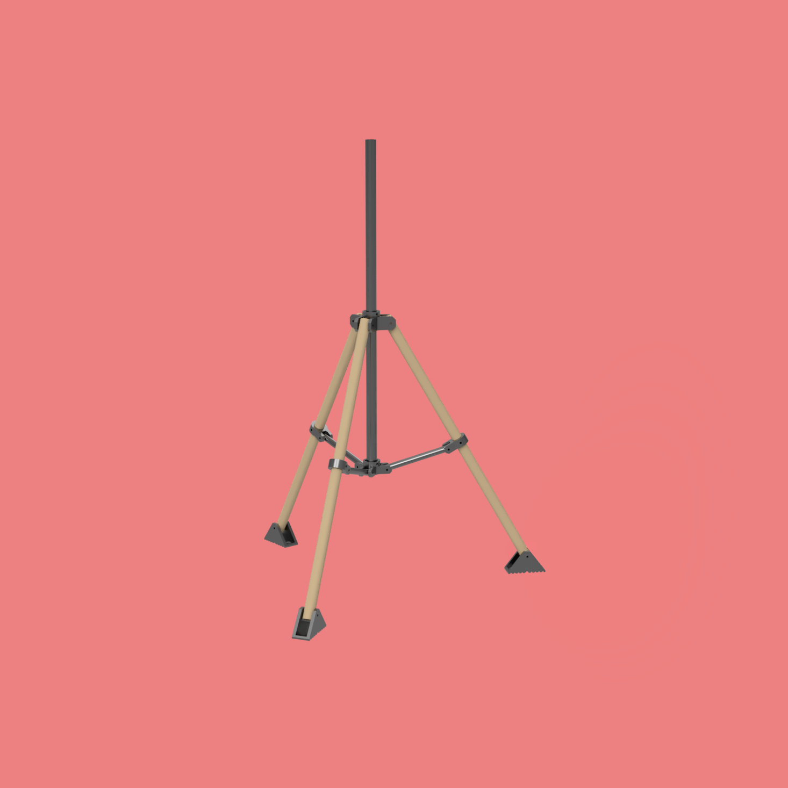
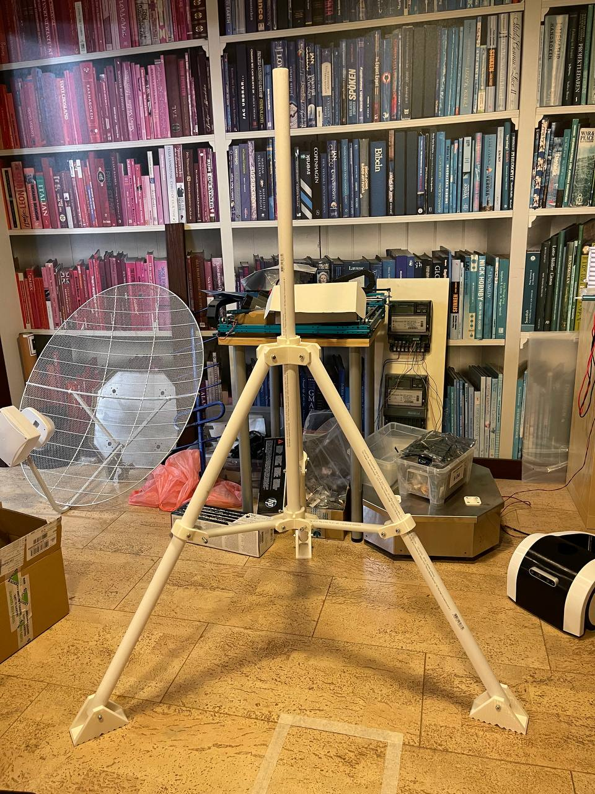
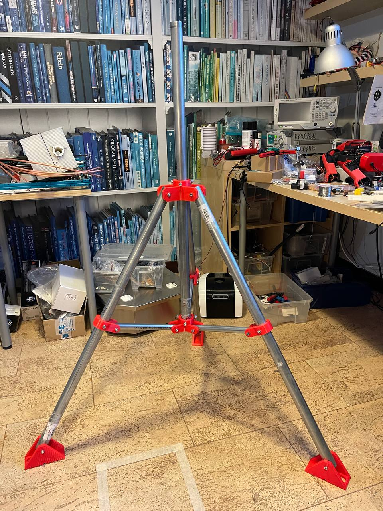

# Tripod

A simple DIY trypod which I designed to mount ham radio satellite antennas in my yard. It is assembled from 3D printed parts and standard 32mm pipes. Depending on your durability requirments the tripod can be assempled using standard polypropylene or steel pipes. I tried both and while polypropylene is much simplier to cut and drill the steel variant is much more durable with much less backlash. Depending on budget you can use zinc-coated steel, stainless steel or just standard stell pipes.

## Preparation

To prepare for assembly you need to print 3D parts. I did mine using PLA with 30% fill and it worked out pretty well. You need to print:
* Bottom-cross.stl - 1 pc
* Top-cross.stl - 1 pc
* Middle-bracket.stl - 3 pcs
* Foot.stl - 3 pcs

Then you need to cut and drill pipes in acordance with pdf drawings. Be very carefull when drilling the pipes as all holes on a pipe must be in the same plane. Otherwise you will not be able to assembly tripod. You will need:
* Bottom-tube-20x220mm.pdf - 3 pcs
* Foot-tube-32x900mm.pdf - 3 pcs
* Vertical-tube-32x1000mm.pdf - 1 pc

This is approximately 4 meters of 32mm pipe and 1 meter of 20mm pipe

You will need bolts and nuts for the assembly too:
* M6x60 - 9 pcs
* M6x50 - 6 pcs
* M6x16 - 6 pcs
* M6 selflocking nuts - 15 pcs
* M6 standard nuts - 6 pcs

M6x60 bolts are used to fix on 32mm pipes, M6x50 bolts are used to fix on 20mm pipes, both with selflocking nuts. M6x16 bolts with standard M6 nuts are used on both crosses to fix on vertical 32mm pipe.

## Assembly

Tripod assembly is quite simple, the assemblied tripod tooks like this:

(Polypropylene variant)

(Zinc-coated steel variant)
